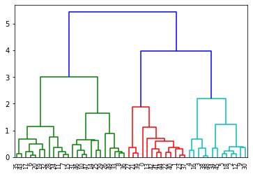

# Hierarchical_Clustering

 

Hierarchical clustering starts by treating each observation as a separate cluster. Then, it repeatedly executes the following two steps:  
  (1) identify the two clusters that are closest together, and  
  (2) merge the two most similar clusters.  
This iterative process continues until all the clusters are merged together, forming an hierarchical structure as shown below.

### Thanks for Reading!
